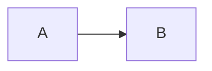

# docx2md-visio

`docx2md-visio` converts a Word `.docx` containing embedded Visio `.vsdx`
diagrams into GitHub-Flavored Markdown with Mermaid blocks.

The pipeline is deterministic and offline-friendly. AI is not required:

```text
DOCX
 ├─ Pandoc → draft Markdown + media
 ├─ Open XML relationships → preview ↔ VSDX ↔ paragraph mapping
 ├─ embedded VSDX extraction
 ├─ native VSDX facts → draft Mermaid + geometry evidence
 ├─ human review → durable final.mmd correction assets
 └─ approved exact Markdown replacement + manifest + reports
```

## MVP guarantees

- The source DOCX is never modified.
- Embedded VSDX files are copied, not rewritten.
- Word relationship IDs determine the VSDX/preview mapping.
- Ambiguous or missing mappings are reported rather than guessed.
- A failed diagram conversion leaves the original Pandoc image in Markdown.
- The default manual-first policy saves every conversion as a draft and does
  not replace the original preview.
- Every `final.mmd` is backed up with adjacent provenance before apply.
- The final output retains links to the original extracted VSDX files.
- The runtime has no Python package dependencies.

## Requirements

- Python 3.10+
- [Pandoc](https://pandoc.org/)
- Optional: [convert2mermaid](https://github.com/jgreywolf/convert2mermaid)
  only for `--converter-mode auto` comparison. It is not required by the
  default offline workflow.

All tools can be installed or copied into an offline network in advance.

## Install

From a downloaded source archive:

```powershell
py -m venv .venv
.\.venv\Scripts\Activate.ps1
pip install .
```

For development:

```powershell
pip install -e .
```

## Usage

Default native, manual-first conversion:

```powershell
docx2md-visio .\documents\design.docx -o .\output
```

Optional comparison with the JavaScript CLI:

```powershell
docx2md-visio .\documents\design.docx -o .\output `
  --converter-mode auto `
  --converter node `
  --converter .\tools\convert2mermaid\dist\cli.js
```

Use explicit offline tool paths if desired:

```powershell
docx2md-visio .\documents\design.docx -o .\output `
  --pandoc .\tools\pandoc\pandoc.exe `
  --converter-mode auto `
  --converter .\tools\node\node.exe `
  --converter .\tools\convert2mermaid\dist\cli.js `
  --keep-work
```

`--converter` is repeatable because the converter command may consist of an
executable plus a JavaScript entrypoint. The program appends:

```text
-i <source.vsdx> -o <raw.mmd> -f mmd
```

## Output

```text
output/
├── design.md
├── manifest.json
├── conversion-report.md
├── HUMAN-REVIEW.md
└── assets/
    ├── media/
    │   └── image1.png
    └── visio/
        └── diagram-001/
            ├── source.vsdx
            ├── raw.mmd
            ├── diagram.json
            ├── geometry-summary.md
            ├── diagnostic.svg
            ├── context.md
            ├── review-prompt.md
            ├── final.mmd       # created by the human review stage
            └── converter.log  # only when the converter fails with output
```

When optional MarkItDown comparison is enabled, the output also contains
`design.ai.md`. It is an AI-oriented reference only; `design.md` remains the
canonical result.

Each successfully mapped Pandoc image is replaced with:

````markdown
<!-- VISIO-BEGIN: diagram-001 -->


[Original Visio diagram](assets/visio/diagram-001/source.vsdx)
<!-- VISIO-END: diagram-001 -->
````

## How deterministic mapping works

A Word object normally contains two relationship IDs: one for its preview and
one for the embedded package. `docx2md-visio` reads
`word/document.xml` and `word/_rels/document.xml.rels` to resolve:

```text
paragraph 28
 ├─ rIdPreview → word/media/image5.emf
 └─ rIdVisio   → word/embeddings/Microsoft_Visio_4.vsdx
```

Pandoc's Markdown reference ending in `media/image5.emf` can then be replaced
without relying on file ordering or AI inference. Pandoc 3.10 may emit a
multiline HTML `` element for media carrying size/style
attributes; the matcher supports both that representation and normal
`` Markdown.

## Current scope and limitations

The MVP supports embedded VSDX objects referenced from the main document part
through common Word VML/OLE and DrawingML structures. It deliberately reports
instead of guessing when:

- a VSDX is present but not referenced by a supported object structure;
- the preview image is missing from Pandoc output;
- the same preview occurs more than once;
- an external converter fails.

The built-in parser reads VSDX page, shape, text, box geometry, line endpoints,
parent IDs and connector XML with the Python standard library. The geometry
layer is domain-neutral: it reports visual facts and generic spatial
relationships but does not claim that geometric containment proves protocol or
business membership. Master inheritance, nested group coordinate transforms,
advanced geometry paths and exact styling remain outside the current scope.

### Geometry evidence

For every parseable VSDX, Stage 1 creates:

- `diagram.json`: complete extracted L1 geometry facts and derived relations;
- `geometry-summary.md`: compact labeled shapes, lines and high-confidence
  relations for a smaller-model review;
- `diagnostic.svg`: a visual box/line overlay labeled with source Shape IDs.

`spatially_inside` means at least 90% of a shape or sampled line lies within
another shape's bounding box. `spatially_overlaps` means at least 20%. These
relations use geometry only and must not be promoted to domain semantics
without supporting evidence.

### Manual-first replacement policy

The default `--review-policy all` marks every diagram `review_required`.
`--review-policy complex` restores the older behavior and marks native output
for review when any of these conditions apply:

- more than one Visio page;
- more than 10 basic nodes;
- more than 25% of nodes have no directly readable label;
- one or more connector endpoints cannot be resolved.

The draft remains at `assets/visio/diagram-NNN/raw.mmd`, and the reason is
recorded in both `manifest.json` and `conversion-report.md`. This policy avoids
presenting a flattened flowchart as an accurate conversion of a signaling,
sequence, UML, or other structurally complex Visio diagram.

Durable correction assets live outside output:

```text
corrections/
├── manifest.json
└── assets/<document>/<docx-sha256>/<diagram>/<vsdx-sha256>/
    ├── final-<mmd-sha256>.mmd
    └── final-<mmd-sha256>.metadata.json
```

The sidecar records where each Mermaid asset came from even if the global
correction manifest is unavailable.

## Four-stage manual-first review workflow

The original preview remains authoritative. Claude reminds and checks; the
human interprets and edits the diagram. See
[docs/MANUAL_REVIEW.md](docs/MANUAL_REVIEW.md) for the full operational guide.

### Stage 1: deterministic conversion and context generation

```powershell
python -m docx2md_visio `
  .\documents\design.docx `
  -o .\output
```

The native parser and `--review-policy all` are defaults. No Node.js or
convert2mermaid installation is required. Every original preview is preserved
until explicit approval.

For each mapped diagram, Stage 1 now creates:

```text
output/assets/visio/diagram-001/
├── source.vsdx
├── raw.mmd
├── diagram.json
├── geometry-summary.md
├── diagnostic.svg
├── context.md
└── review-prompt.md
```

Stage 1 also creates `HUMAN-REVIEW.md` with commands specialized to that output.
`context.md` is generated deterministically from Pandoc's draft Markdown. It
contains the nearest preceding heading and bounded text before and after the
preview. It remains inside the offline output directory and may contain
document content, so apply the same confidentiality controls as the source
DOCX.

### Stage 2: back up and triage

```powershell
docx2md-visio-review backup .\output
docx2md-visio-review list .\output
```

Choose `keep original`, `accept draft`, or `manual redraw` for one diagram.
Keeping the original requires no file change. Existing `final.mmd` files are
stored outside output under the sibling `corrections/` directory.

### Stage 3: manually edit and check

For a signaling diagram:

```powershell
docx2md-visio-review scaffold .\output `
  --diagram diagram-001 `
  --type sequence
```

Edit `final.mmd` beside the original Word/Visio and a local Mermaid preview.
Then run:

```powershell
docx2md-visio-review check .\output --diagram diagram-001
```

The inventory check reports missing and unexpected message labels. The human
must still verify direction, order, participants, grouping, and meaning.

### Stage 4: apply one human-approved final.mmd

After comparing `final.mmd` with the original preview:

```powershell
python -m docx2md_visio.apply_review `
  .\output `
  --diagram diagram-001 `
  --approve
```

The installed console command is equivalent:

```powershell
docx2md-visio-apply .\output --diagram diagram-001 --approve
```

The apply command:

- requires the explicit `--approve` flag;
- backs up every `final.mmd` before later checks;
- creates an adjacent provenance sidecar for every correction asset;
- validates the Mermaid declaration;
- checks message-label conservation;
- rejects Markdown code fences and empty output;
- uses `manifest.json` to replace the exact preview;
- wraps `final.mmd` in a Markdown Mermaid code block;
- retains a link to `source.vsdx`;
- creates `<document>.md.pre-review` before the first reviewed replacement;
- records `converted_after_review` and `final_mermaid` in `manifest.json`.

Use `--allow-message-differences` only after explicitly examining the generated
`manual-check.json`. Repeat Stages 2–4 for each approved diagram. Unapproved
diagrams continue to display their original Pandoc preview.

Restore a previous approved correction only when the current source VSDX hash
matches:

```powershell
docx2md-visio-review restore .\output --diagram diagram-001
```

Restoration creates `final.mmd` for reinspection; it never applies it.

Start Claude Code in the repository root and ask:

```text
Use $review-visio-mermaid on .\output. Remind me of only the next safe step.
Do not redraw the diagram for me.
```

## Markdown correction skill

The repository includes a Claude Code project skill at
`.claude/skills/correct-docx-markdown/`. It combines a deterministic audit with
strict review guardrails.

Run the audit without AI:

```powershell
docx2md-visio-correct .\output\design.md --write --fail-on never
```

With an optional MarkItDown second opinion:

```powershell
docx2md-visio .\documents\design.docx -o .\output `
  --markitdown markitdown

docx2md-visio-correct .\output\design.md `
  --reference .\output\design.ai.md `
  --write --fail-on never
```

The command writes `correction-report.json` and `correction-report.md`.
Automatic changes are limited to newline normalization, BOM removal, final
newline normalization, and collapsing excessive blank lines outside fenced
code. Potentially semantic changes—including Pandoc backslash escapes,
headings, tables, missing images, and orphaned HTML—are only reported.

Start Claude Code in the repository root and ask:

```text
Use $correct-docx-markdown to audit output/design.md.
```

Claude must use MarkItDown only as supporting evidence and must not edit
reviewed Mermaid blocks through the document correction workflow.

## Complete offline deployment

See [docs/DEPLOYMENT.md](docs/DEPLOYMENT.md) for the supported topology,
bundle creation, isolated-network installation, Claude Code operation, and
acceptance checks. `scripts/New-OfflineBundle.ps1` can package the repository
with optional Pandoc, MarkItDown wheelhouse, and legacy Node/convert2mermaid
comparison tools.

Headers, footers, text boxes stored outside the main document flow, linked
rather than embedded Visio files, and visual floating-object coordinates are
not yet mapped. Multi-page behavior is determined by the installed
convert2mermaid version.

## Test

The test suite uses synthetic DOCX files and fake external commands, so it
does not require Pandoc or convert2mermaid:

```powershell
pip install pytest
pytest
```

Generate a non-confidential synthetic VSDX and a DOCX embedding that VSDX:

```powershell
python .\scripts\generate_sample.py
```

The generated flow contains two nodes and one connector. Its connector text
uses an empty field structure that exposes a known fragile assumption in
`vsdx-js`, while the built-in parser handles it deterministically.

Or run the standard-library tests after installing a test runner in the
offline environment.

## Security

DOCX is a ZIP container. Extraction checks every member path before writing it
to prevent path traversal. External tools receive argument arrays rather than
shell command strings.

## Roadmap

- Parse headers, footers and additional document parts.
- Resolve Master-inherited geometry and nested Group coordinate transforms.
- Add exact Geometry-section paths and richer multi-page diagnostics.
- Add optional Mermaid syntax validation.
- Add an optional, separate AI review layer.
- Package the CLI behind a Claude Code or Codex skill.

## License

MIT
